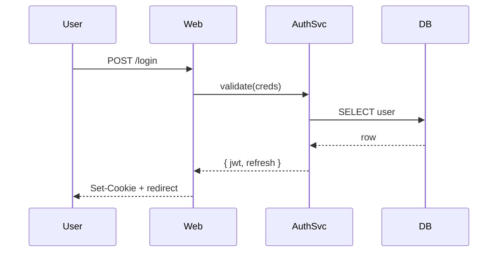
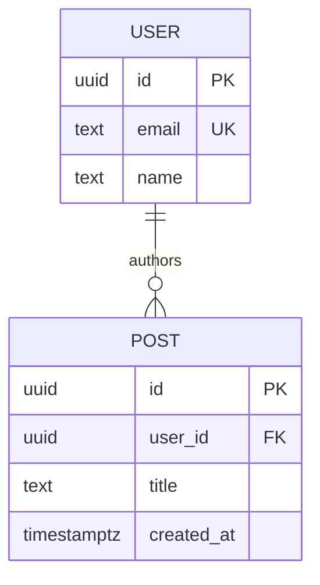

# Mermaid / d2 diagram generation

The agent writes diagram source inline (text), the `render_diagram` tool rasterises it via the local CLI. Two languages supported, pick by use case.

## Decision tree

| Use case | Pick |
|---|---|
| System architecture, infra topology, service maps | **d2** — cleaner default layouts, smarter routing, instant render |
| Flowcharts, simple decision trees | either; d2 if you want it pretty by default, mermaid if it goes in GitHub markdown |
| Sequence diagrams | **mermaid** — richer participant syntax, activation boxes, alt/par/loop blocks |
| ER diagrams | **mermaid** — `erDiagram` syntax is more compact than d2's `sql_table` shapes |
| State diagrams | **mermaid** — `stateDiagram-v2` is purpose-built |
| Gantt / timeline | **mermaid** — only one with native support |
| Mindmap | **mermaid** — only one with native support |
| Class diagrams / UML | **mermaid** — purpose-built syntax |
| Goes inside a GitHub README that renders mermaid natively | **mermaid** — no SVG file to manage |
| Goes into custom docs site / static export / PDF | **d2** preferred — faster, cleaner, no puppeteer dep |

If in doubt for architecture: **d2**. If in doubt for protocol/dataflow: **mermaid sequence**.

## Workflow

1. **Write source inline** — you (the agent) write the diagram text directly. Don't shell out to generate it.
2. **Render to validate** — call `render_diagram(language=..., source=...)` with no `outputPath` first. If it errors, the parser stderr tells you what to fix.
3. **Render to file** — once syntax is clean, call again with `outputPath` to save SVG or PNG.

```
render_diagram(
  language="d2",
  source="...",
  outputPath="docs/architecture.svg"
)
```

## Mermaid — common pitfalls

- **Quote labels with special chars.** `A[node (with parens)]` breaks; use `A["node (with parens)"]`.
- **`graph TD` vs `flowchart TD`** — both work, `flowchart` is newer with more features. Use `flowchart`.
- **Subgraph labels need quotes** if they contain spaces: `subgraph "App Layer"`.
- **Sequence diagrams**: `participant A as Alice` not `participant A: Alice`.
- **ER diagrams**: relationship syntax is `||--o{` style (one-to-many), `||--||` (one-to-one), `}o--o{` (many-to-many).
- **Styling**: `classDef big fill:#f00,stroke:#333` then `class A,B big`.
- **Themes**: `'default' | 'dark' | 'forest' | 'neutral'`. Set via `theme` param.

## d2 — common pitfalls

- **No semicolons.** Lines are statement-separated by newline.
- **Connection arrows**: `a -> b` (directed), `a <-> b` (bidirectional), `a -- b` (undirected). NOT `a --> b`.
- **Container shapes**: `app: { ... }` makes `app` a container; children are `app.api`, `app.db`, etc.
- **Shape names**: `rectangle` (default), `square`, `oval`, `circle`, `diamond`, `parallelogram`, `hexagon`, `cylinder`, `queue`, `package`, `cloud`, `step`, `person`, `class`, `sql_table`, `image`. Specified as `node.shape: cloud`.
- **Connection labels**: `a -> b: "writes"`.
- **Styling**: `node.style.fill: "#f00"`, `node.style.stroke-width: 2`.
- **Layout engines**: `dagre` (default, hierarchical), `elk` (more compact), `tala` (paid). Set via CLI flag — `render_diagram` uses dagre.
- **Themes**: numeric ids. `0` default, `1` neutral grey, `100` dark, `101` dark mauve, `200` flagship, `300` terminal, `301` terminal grayscale, `400` origami. Set via `theme` param as a string.

## Examples

### Mermaid sequence — auth flow



### d2 — service architecture

```d2
direction: right

web: {
  shape: rectangle
  edge: nginx
  api: hono
}

queue: {
  shape: queue
  label: "valkey list"
}

worker: {
  shape: package
  label: "bun worker"
}

db: {
  shape: cylinder
  label: "postgres 17"
}

web.api -> queue: "enqueue job"
queue -> worker: "consume"
worker -> db: "write"
web.api -> db: "read"
```

### Mermaid ER — minimal schema



## Themes — quick picker

| Vibe | Mermaid | d2 |
|---|---|---|
| Light, default | `default` | `0` |
| Dark | `dark` | `100` |
| Hand-drawn / sketchy | `forest` (close) | use d2 `--sketch` (not via this tool yet) |
| Monochrome / print | `neutral` | `301` |
| Terminal | (n/a) | `300` |

## When to use raw mmdc/d2 instead

Stay with `render_diagram` unless:

- You need `--watch` mode (live reload during interactive design)
- You need d2's `tala` paid layout engine
- You're rendering to PPTX or PDF directly (d2 supports these — extend the tool if recurring need)
- Bulk rendering 10+ diagrams (pipe via bash; tool launches one CLI per call)
