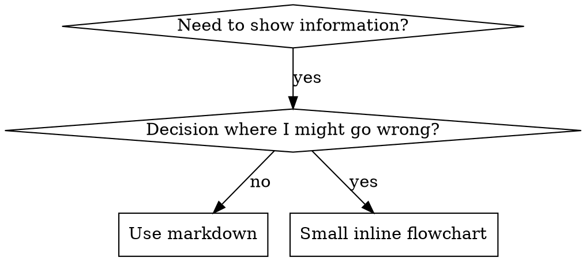

# Writing Skills

## Overview

A skill is a reference guide for a proven technique, pattern, or tool, written
so a future agent can find it and apply it. Skills that enforce discipline are
tested like code: watch an agent fail the scenario without the skill, write the
skill against those specific failures, watch it pass, close the loopholes.

**Core principle:** If you didn't watch an agent fail without the skill, you
don't know if the skill teaches the right thing.

**Where skills live.** Personal skills live canonically in
`~/dotfiles/.pi/agent/skills/<name>/` (pi is the primary harness). A skill
reaches Claude Code only through an explicit per-skill symlink in
`~/dotfiles/.claude/skills/` - the work harness is opt-in, and the directory
contents are the allowlist. Policy: `~/dotfiles/.claude/CLAUDE.md`,
"Agent-surface routing".

**Official guidance:** Anthropic's skill authoring best practices are vendored
in anthropic-best-practices.md (read when you want the upstream rationale for
progressive disclosure, description shape or body length). This document is the
local policy layered on top.

## Skill Lifecycle (local policy)

How skills are born, change, and die in this tree. Distilled from the
2026-05-25 superpowers audit, the 2026-08-13 corpus review and the 2026-08-16
removal of that skill set.

- **Born from proven patterns, not speculation.** A skill generalizes
  something that already worked by hand (sa-pov grew out of Supabase PoV
  harness scripts; validating-empirically split out of sa-pov once the
  discipline stood alone). If the pattern has happened once, it is not yet
  a skill.
- **Descriptions are trigger surfaces, not docs.** Lead with "Use when ..."
  and the firing conditions; coverage/process summaries belong in the body.
  Heavyweight process skills get "Use ONLY when the user explicitly asks" -
  auto-fire is the recurring enemy.
- **Skills track the system.** When the thing a skill describes changes,
  update the skill in the same commit (the lexicanum dev-watcher pattern).
  A stale skill is a defect, not a backlog item.
- **Delete, don't disable.** `.disabled` files accumulate ghosts. Git
  history is the archive - remove the skill and reference the removal
  commit if the rationale matters.
- **No upstream sync of vendored skills.** Once a third-party skill is
  forked into this tree it is ours: curated locally, never re-synced, never
  pushed back. A sync pipeline over locally-edited content is a merge
  conflict on a schedule.
- **Batch edits validate with a real YAML parser.** The 2026-08-13
  description sweep broke two frontmatters with unquoted `: ` in plain
  scalars while line-prefix checks passed. Parse, don't eyeball -
  `skills-lint` does (Maintenance, below).
- **Dated lessons self-prune.** Inline dated lesson entries are
  institutional memory, but when a lesson's warning becomes the documented
  default behavior, fold it into the body as a plain rule and delete the
  date and the story. The file should not grow monotonically.

## Maintenance: `skills-lint`

```bash
python3 ~/dotfiles/scripts/skills-lint.py                 # whole corpus
python3 ~/dotfiles/scripts/skills-lint.py --only <skill>  # one skill
python3 ~/dotfiles/scripts/skills-lint.py --json          # machine output
```

It checks every `<skills>/<name>/SKILL.md`: frontmatter parses and `name`
matches the directory; description length (warn over 500 characters, error
over 1024) and shape ("Use when" / "Use ONLY when", no workflow verbs); body
under 500 lines; no smart punctuation (em/en dash, curly quotes, ellipsis,
nbsp); no `@`-links; every supporting file referenced from SKILL.md; every
tilde path exists; retired terms absent (from `.pi/agent/skills/.lint.json`,
with per-skill `allow` exceptions); docs-source names are real docs topics;
`\`name\` skill` references resolve; dated-lesson density; `metadata.verified`
age; Claude Code symlinks not dangling. Exit 1 on any ERROR.

Optional frontmatter so the lint can flag a stale skill:

```yaml
metadata:
  verified: 2026-09-05
```

Run it before committing a skill change. Skills track the system, so the
skill edit and the system change belong in the same commit.

## What is a Skill?

**Skills are:** Reusable techniques, patterns, tools, reference guides

**Skills are NOT:** Narratives about how you solved a problem once

## When to Create a Skill

**Create when:**
- Technique wasn't intuitively obvious to you
- You'd reference this again across projects
- Pattern applies broadly (not project-specific)

**Don't create for:**
- One-off solutions
- Standard practices well-documented elsewhere
- Project-specific conventions (put in the repo's AGENTS.md)
- Mechanical constraints (if it's enforceable with regex/validation, automate it - save documentation for judgment calls)

## Skill Types

- **Technique** - concrete method with steps to follow (condition-based-waiting, root-cause-tracing)
- **Pattern** - way of thinking about problems (flatten-with-flags, test-invariants)
- **Reference** - API docs, syntax guides, tool documentation
- **Discipline** - rules an agent must hold under pressure (verification-before-completion, epistemics)

## Directory Structure

```
skills/
  skill-name/
    SKILL.md              # Main reference (required)
    supporting-file.*     # Only if needed
```

**Flat namespace** - all skills in one searchable namespace

**Separate files for:**
1. **Heavy reference** (over ~100 lines) - API docs, comprehensive syntax, lesson logs
2. **Reusable tools** - Scripts, utilities, templates

**Keep inline:**
- Principles and concepts
- Code patterns (under 50 lines)
- The judgment: when to use, when not to, what goes wrong

## SKILL.md Structure

**Frontmatter (YAML):**
- Two required fields: `name` and `description` (see [agentskills.io/specification](https://agentskills.io/specification) for all supported fields)
- `name`: letters, numbers, and hyphens only (no parentheses, special chars); must equal the directory name
- `description`: Third-person, describes ONLY when to use (NOT what it does)
  - Start with "Use when..." ("Use ONLY when the user explicitly asks" for heavyweight process skills)
  - List concrete triggers: symptoms, phrases, situations, file names
  - End with a "NOT for <sibling skill>" clause where confusion with a sibling is possible
  - **NEVER summarize the skill's process or workflow** (see CSO section for why)
  - Keep under 500 characters; 1024 is the hard limit
  - Quote the YAML string if it contains `: `
- Optional `metadata: {verified: YYYY-MM-DD}` (see Maintenance)

```markdown
---
name: skill-name-with-hyphens
description: "Use when [specific triggering conditions and symptoms]. NOT for [sibling]."
---

# Skill Name

## Overview
What is this? Core principle in 1-2 sentences.

## When to Use
[Small inline flowchart IF decision non-obvious]

Bullet list with SYMPTOMS and use cases
When NOT to use

## Core Pattern (for techniques/patterns)
Before/after code comparison

## Quick Reference
Table or bullets for scanning common operations

## Implementation
Inline code for simple patterns
Link to file for heavy reference or reusable tools

## Common Mistakes
What goes wrong + fixes

## Files (when there are siblings)
`name.md` - what it holds; read when ...
```

## Claude Search Optimization (CSO)

**Critical for discovery:** Future Claude needs to FIND your skill

### 1-2. Description field and keywords

The description decides whether the body is ever read, so it lists triggers,
never workflow: a description that summarizes the process becomes a shortcut
the agent follows instead of reading the skill (observed: "code review between
tasks" produced one review where the body specified two). Rules: start with
"Use when" / "Use ONLY when the user explicitly asks"; third person; concrete
symptoms, phrases and file names; end with "NOT for <sibling>" where confusion
is possible; under 500 characters; quote the YAML string if it contains `: `.
Use the words an agent would search for - error text, symptoms, synonyms,
tool names. Worked good/bad examples: description-writing.md (read when
calibrating a description).

### 3. Descriptive Naming

**Use active voice, verb-first; name by what you DO or the core insight:**
- `creating-skills` not `skill-creation`
- `condition-based-waiting` not `async-test-helpers`
- `flatten-with-flags` over `data-structure-refactoring`
- `root-cause-tracing` over `debugging-techniques`

**Gerunds (-ing) work well for processes:** `creating-skills`, `testing-skills`, `debugging-with-logs`

### 4. Context cost: what every turn pays for

Only the `name` and `description` of every skill are always in context (this
is what anthropic-best-practices.md calls metadata pre-loading). pi loads the
body on demand via `read`, and sibling files only when the body points at
them. So:

- **Description under 500 characters.** Every turn of every session pays for
  it, across all ~70 skills. The lint warns past 500 and errors past 1024.
- **Body under 500 lines.** Loaded only when the skill fires, but then it
  competes with the conversation. Keep the judgment in the body.
- **Reference over ~100 lines goes in a sibling file**, linked from SKILL.md
  by plain filename with a "read when ..." cue and a table of contents at the
  top of the sibling. One level deep: SKILL.md -> sibling, never sibling ->
  sibling chains the reader has to follow to find the rule.

**Techniques:**

Move details to tool help:
```bash
# BAD: Document all flags in SKILL.md
search-conversations supports --text, --both, --after DATE, --before DATE, --limit N

# GOOD: Reference --help
search-conversations supports multiple modes and filters. Run --help for details.
```

Cross-reference instead of repeating:
```markdown
# BAD: Repeat workflow details
When searching, dispatch subagent with template...
[20 lines of repeated instructions]

# GOOD: Reference other skill
Always use subagents (50-100x context savings). REQUIRED: Use [other-skill-name] for workflow.
```

Compress examples:
```markdown
# BAD: Verbose example (42 words)
The user: "How did we handle authentication errors in React Router before?"
You: I'll search past conversations for React Router authentication patterns.
[Dispatch subagent with search query: "React Router authentication error handling 401"]

# GOOD: Minimal example (20 words)
User: "How did we handle auth errors in React Router?"
You: Searching...
[Dispatch subagent -> synthesis]
```

Eliminate redundancy: don't repeat what's in cross-referenced skills, don't
explain what's obvious from the command, don't include multiple examples of
the same pattern.

**Verification:** `python3 ~/dotfiles/scripts/skills-lint.py --only <skill>`
reports description characters and body lines.

### 5. Cross-Referencing Other Skills and Files

Use the skill name only, with explicit requirement markers:
- Good: `**REQUIRED SUB-SKILL:** Use writing-plans`
- Good: `**REQUIRED BACKGROUND:** You MUST understand systematic-debugging`
- Bad: `See skills/foo/bar` (path-shaped, unclear if required)
- Bad: `@some-file.md` (force-loads, burns context)

Sibling files are linked by plain filename: `see root-cause-tracing.md (read
when the error is deep in a call stack)`. **Why no @ links:** `@` syntax
force-loads files immediately, consuming context before you need them. The
lint flags them.

## Flowchart Usage



**Use flowcharts ONLY for:**
- Non-obvious decision points
- Process loops where you might stop too early
- "When to use A vs B" decisions

**Never use flowcharts for:**
- Reference material -> Tables, lists
- Code examples -> Markdown blocks
- Linear instructions -> Numbered lists
- Labels without semantic meaning (step1, helper2)

See graphviz-conventions.dot for graphviz style rules (read when you are
writing a `dot` block).

**Visualizing for the user:** `render-graphs.js` in this directory renders a
skill's flowcharts to SVG:
```bash
./render-graphs.js ../some-skill           # Each diagram separately
./render-graphs.js ../some-skill --combine # All diagrams in one SVG
```

## Code Examples

**One excellent example beats many mediocre ones**

Choose most relevant language:
- Testing techniques -> TypeScript/JavaScript
- System debugging -> Shell/Python
- Data processing -> Python

**Good example:** complete and runnable, well-commented explaining WHY, from a
real scenario, shows the pattern clearly, ready to adapt (not a generic
template).

**Don't:** implement in 5+ languages, create fill-in-the-blank templates, write
contrived examples. You're good at porting - one great example is enough.

## File Organization

### Self-Contained Skill
```
defense-in-depth/
  SKILL.md    # Everything inline
```
When: All content fits, no heavy reference needed

### Skill with Reusable Tool
```
condition-based-waiting/
  SKILL.md    # Overview + patterns
  example.ts  # Working helpers to adapt
```
When: Tool is reusable code, not just narrative

### Skill with Heavy Reference
```
self-correcting-loop/
  SKILL.md          # Quick start, manifest reference, files table, limits
  docs/governor.md  # How the loop works, with a table of contents
  docs/lessons.md   # Harnessability lessons
  loop.ts ...       # Executable tools
```
When: Reference material too large for inline. Each sibling starts with a
table of contents; SKILL.md links each one with a "read when ..." cue.

## Testing: baseline first

The global TDD rule (`~/dotfiles/.pi/agent/prompts/tool-routing.md`, "TDD
where useful") is pragmatic: tests before logic and bug fixes, no ritual for
scaffolding and glue. Skill testing follows the same split:

- **Discipline skills, and edits to their rules, get a baseline scenario
  first.** Run the pressure scenario with a subagent WITHOUT the skill (or
  without the new rule) and record the exact rationalizations. Then write
  the skill against those, re-run, and close the loopholes that appear. A
  discipline rule you never watched an agent break is a guess about what
  agents do.
- **Technique and pattern skills get an application scenario**: can a fresh
  agent apply it to a case the skill did not use as its example?
- **Reference skills get a retrieval check**: can a fresh agent find the
  right entry and use it correctly? A gap here is a missing row, not a
  loophole.
- **Structural edits** (moving reference into a sibling, trimming a
  description, fixing links) get the lint plus a read-through; they do not
  need a pressure scenario.

Methodology, pressure types, and the plugging-holes loop: see
testing-skills-with-subagents.md (read when you are about to test a
discipline skill or an edit to one).

## Common Rationalizations for Skipping the Baseline

| Excuse | Reality |
|--------|---------|
| "Skill is obviously clear" | Clear to you != clear to other agents. Test it. |
| "It's just a reference" | References can have gaps. A retrieval check is five minutes. |
| "I'll test if problems emerge" | Problems = agents can't use skill. Test BEFORE deploying. |
| "I'm confident it's good" | Confidence is not a baseline transcript. |
| "Academic review is enough" | Reading != using. Test application scenarios. |
| "No time to test" | A discipline rule that does not hold under pressure costs every session that trusts it. |

## Bulletproofing Discipline Skills

Agents under pressure find loopholes, so a discipline skill closes them
explicitly: forbid the specific workarounds (not just the act), state early
that violating the letter is violating the spirit, keep a rationalization
table built from real baseline transcripts, keep a red-flags list an agent can
self-check against, and put the violation symptoms ("should work now", "just
this once") into the description. The full method and worked iterations are in
testing-skills-with-subagents.md ("REFACTOR Phase: Close Loopholes"); the
psychology behind why those shapes hold is in persuasion-principles.md
(Cialdini, 2021; Meincke et al., 2025) - read when designing a discipline skill.

That shape is for rules that really are absolute in this tree - verification
evidence, provenance of specifics, secret handling. TDD itself is pragmatic
here (tool-routing.md), so do not copy a "no exceptions" TDD mandate into a
new skill.

## Anti-Patterns

- **Narrative example** - "In session 2025-10-03, we found empty projectDir caused..." Too specific, not reusable. Fold the lesson into a rule.
- **Multi-language dilution** - example-js.js, example-py.py, example-go.go. Mediocre quality, maintenance burden.
- **Code in flowcharts** - `step1 [label="import fs"]`. Can't copy-paste, hard to read.
- **Generic labels** - helper1, helper2, step3. Labels should have semantic meaning.
- **Retired names** - a harness, host or tool that no longer exists, kept because the sentence still parses. The lint's retired-term list exists for this; add to it when something is decommissioned.

## Skill Creation Checklist

Track these as an explicit checklist (one item per line) and tick them off.

**Baseline (discipline skills and rule edits):**
- [ ] Create pressure scenarios (3+ combined pressures for discipline skills)
- [ ] Run scenarios WITHOUT skill - document baseline behavior verbatim
- [ ] Identify patterns in rationalizations/failures

**Write:**
- [ ] Name uses only letters, numbers, hyphens; equals the directory name
- [ ] YAML frontmatter with `name` and `description`; string quoted if it contains `: `
- [ ] Description starts with "Use when..." (or "Use ONLY when the user explicitly asks"), lists concrete triggers, ends with NOT-for sibling, under 500 characters, no workflow summary
- [ ] Description written in third person
- [ ] Keywords throughout for search (errors, symptoms, tools)
- [ ] Clear overview with core principle
- [ ] Address specific baseline failures identified above
- [ ] Code inline OR link to separate file by plain filename with a read-when cue
- [ ] One excellent example (not multi-language)
- [ ] Body under 500 lines; reference over ~100 lines in a sibling with a table of contents
- [ ] Run scenarios WITH skill - verify agents now comply (discipline skills); retrieval check (reference skills)

**Close loopholes (discipline skills):**
- [ ] Identify NEW rationalizations from testing
- [ ] Add explicit counters
- [ ] Build rationalization table from all test iterations
- [ ] Create red flags list
- [ ] Re-test until the rule holds

**Quality checks:**
- [ ] Small flowchart only if decision non-obvious
- [ ] Quick reference table
- [ ] Common mistakes section
- [ ] No narrative storytelling; dated lessons folded into rules
- [ ] Supporting files only for tools or heavy reference, every one linked from SKILL.md
- [ ] ASCII punctuation (the write hook blocks em/en dashes, smart quotes, ellipsis)

**Deploy:**
- [ ] `python3 ~/dotfiles/scripts/skills-lint.py --only <skill>` reports 0 errors
- [ ] Work-relevant? Add the symlink in `~/dotfiles/.claude/skills/`; otherwise leave it pi-only
- [ ] Commit with the system change it documents

## Discovery Workflow

How future Claude finds your skill:

1. **Encounters problem** ("tests are flaky")
2. **Finds SKILL** (description matches)
3. **Scans overview** (is this relevant?)
4. **Reads patterns** (quick reference table)
5. **Loads sibling file** (only when implementing)

**Optimize for this flow** - put searchable terms early and often.

## Files

- `anthropic-best-practices.md` - Anthropic's vendored skill authoring guide; read when you want the upstream rationale
- `testing-skills-with-subagents.md` - baseline / pressure-test / close-loopholes methodology; read when testing a discipline skill
- `persuasion-principles.md` - why the bulletproofing shapes work; read when designing a discipline skill
- `description-writing.md` - description calibration with good/bad examples; read when writing or trimming a description
- `graphviz-conventions.dot` - style rules for `dot` flowcharts; read when writing one
- `render-graphs.js` - renders a skill's flowcharts to SVG for the user
- `examples/CLAUDE_MD_TESTING.md` - worked example of pressure scenarios for a rules file

## The Bottom Line

A skill is a claim about what agents should do. Discipline claims get a
baseline before they ship; reference claims get a retrieval check; every skill
gets the lint. Skills track the system, so update them in the commit that
changes the system.
